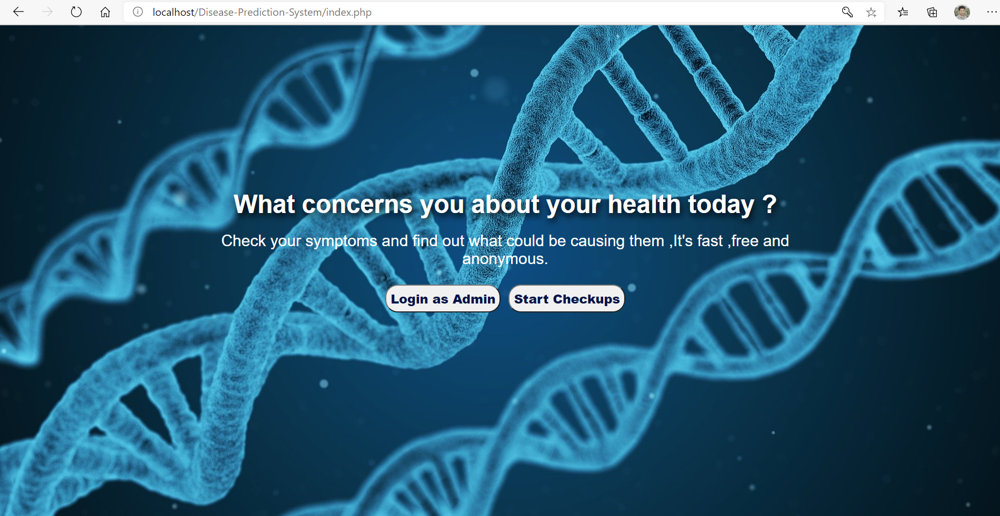
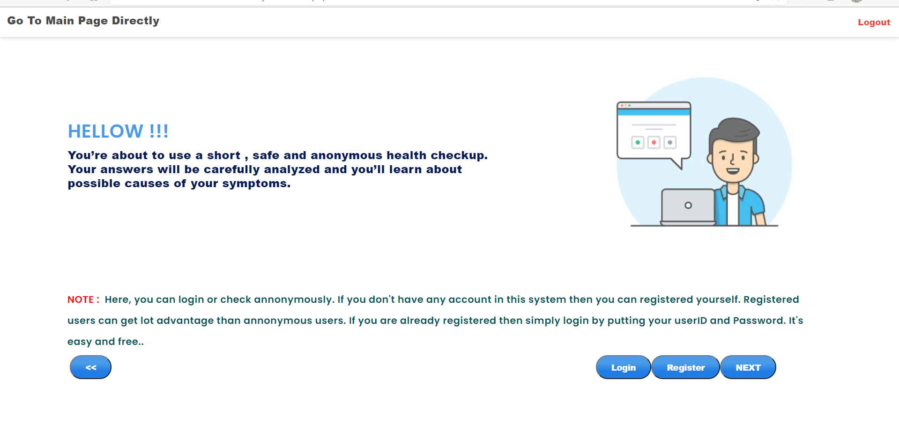

# Disease-Prediction-System using PHP.

#The project is done using core php.

#### Project Description: This Project basically predicst the disease based on your symptoms.Login is not mandatory for checking the disease. First you have to select the portion of your body which you have problems with.Then After selecting some symptoms you can get the prediction of the disease.

#### Restriction : You can only check the front part of your body.

#### Cautions : This  is just a prediction of disease.The model just analyzes the symptoms and based on that symptoms it produces output.

##### Note: This Project is Not fully Responsive 

#####  log in or you can Register. 

For Admin Login UserName: admin 
                Password: Ab123456

For User Login UserName: user
               Password:Ab123456

#### Some of the screenshots are given below :

